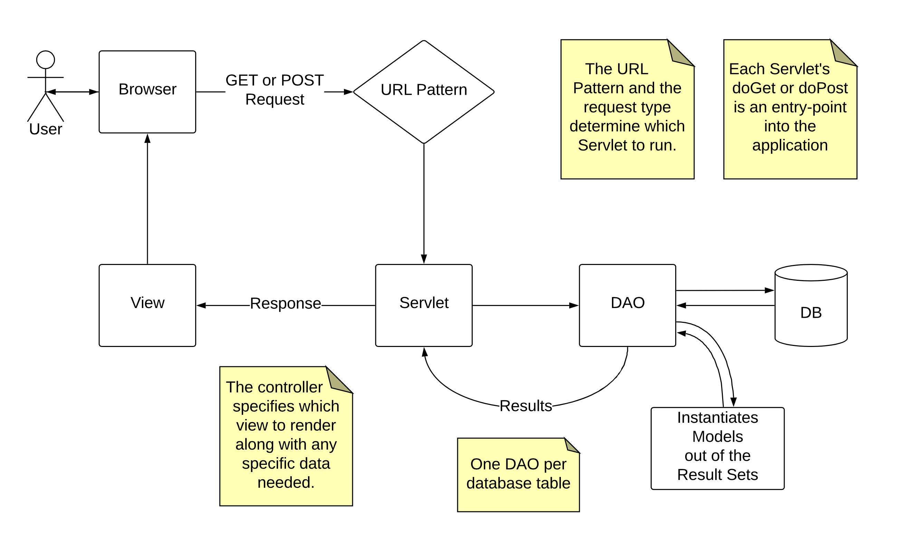

# Reviewing Model-View-Controller Implementation with Servlets, DAOs, and JSP

## General Diagram of MVC w/ Servlets and DAOs

## Specific Diagram of Quotes
- endpoints
    - /quotes/all
    - /quotes/random
    - /quotes/create
- servlets
- DAO
- table
- views
- Quote model

## Request Inspector Example
GET to /request-inspector
- Servlet reads all the request information
- Wire up those variables to the view
- The .jsp should output those request 
- The .jsp should also have an example form that posts to 
- This .jsp should have some example pre-built anchor tags

POST to /request-inspector
- Write po
request-inspector.jsp

https://github.com/CodeupClassroom/yosemite-adlister/blob/master/src/main/java/QuotesDao.java

Quotes 
    DAO
    Servlet
        /quotes/all
        /quotes/random
        /quotes/create
    Views
        Index
        Show
        Create

Each quote has author and quote properties

Make database for `reviewlister_db`
`Config.java`
reviewlister_db
reviewlister_user

